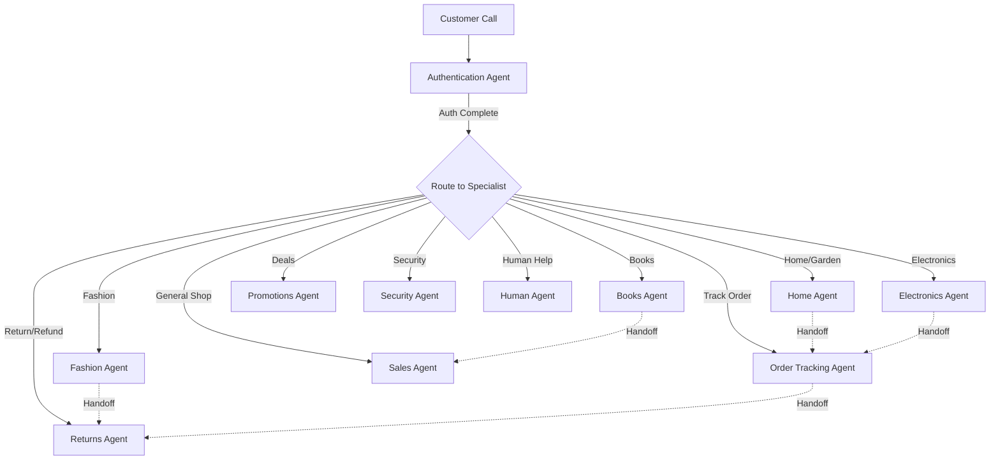

# Multi-Agent Migration - Quick Start Guide

## 🎯 What We're Building

Transform your **14-agent OpenAI Realtime system** into a **LiveKit-native multi-agent workflow**.

```
Current: OpenAI Realtime API (RealtimeAgent)
Target:  LiveKit Agents Framework (voice.Agent + Handoffs)
```

---

## 📊 System Overview



---

## 🏗️ Architecture Pattern

### Before (OpenAI Realtime)
```typescript
// OpenAI Realtime API
export const homeAgent = new RealtimeAgent({
  name: 'homeAgent',
  voice: 'sage',
  handoffDescription: '...',
  instructions: '...',
  tools: [ tool({ ... }) ],
  handoffs: [], // Auto-populated
});
```

### After (LiveKit)
```typescript
// LiveKit Agents Framework
export class HomeAgent extends voice.Agent {
  constructor() {
    super({
      instructions: '...',
      tools: {
        getProductDimensions: llm.tool({
          description: '...',
          parameters: z.object({ ... }),
          execute: async ({ ... }) => { ... },
        }),
        // + handoffTool (universal)
      },
    });
  }
}
```

---

## 🚀 Implementation in 3 Steps

### Step 1: Create Authentication Agent (Primary Entry)
```typescript
// File: packages/backend/src/agents/authenticationAgent.ts

import { voice, llm } from '@livekit/agents';
import { z } from 'zod';

export class AuthenticationAgent extends voice.Agent {
  constructor() {
    super({
      instructions: `
You are the initial contact for TAWK.TO Marketplace.

Flow: Greeting → Name → Phone → DOB → SSN/CC → Address → Disclosure → Route

CRITICAL:
- Repeat sensitive info back digit-by-digit
- Complete FULL auth flow before transferring
- Read disclosure VERBATIM at faster pace
      `,
      tools: {
        authenticateUser: llm.tool({
          description: 'Verify identity',
          parameters: z.object({
            phoneNumber: z.string(),
            dateOfBirth: z.string(),
            last4Digits: z.string(),
            last4Type: z.enum(['ssn', 'credit_card']),
          }),
          execute: async (data) => {
            // TODO: Real auth API
            return { success: true, customerId: 'CUST123' };
          },
        }),
        
        saveAddress: llm.tool({
          description: 'Save verified address',
          parameters: z.object({
            phoneNumber: z.string(),
            street: z.string(),
            city: z.string(),
            state: z.string(),
            postalCode: z.string(),
          }),
          execute: async (data) => {
            // TODO: Real address API
            return { success: true };
          },
        }),

        logOfferResponse: llm.tool({
          description: 'Log promotional offer response',
          parameters: z.object({
            phoneNumber: z.string(),
            offerId: z.string(),
            response: z.enum(['ACCEPTED', 'DECLINED', 'REMIND_LATER']),
          }),
          execute: async (data) => {
            // TODO: Real offer API
            return { success: true };
          },
        }),
      },
    });
  }
}
```

### Step 2: Create Handoff Coordinator
```typescript
// File: packages/backend/src/agents/handoffCoordinator.ts

import { voice } from '@livekit/agents';

export interface CustomerContext {
  customerId?: string;
  phoneNumber?: string;
  firstName?: string;
  authenticatedAt?: Date;
  currentIntent?: string;
}

export class HandoffCoordinator {
  private currentAgent: voice.Agent;
  private customerContext: CustomerContext;

  constructor(initialAgent: voice.Agent, context: CustomerContext) {
    this.currentAgent = initialAgent;
    this.customerContext = context;
  }

  async transferTo(targetAgentName: string, reason: string): Promise<voice.Agent> {
    // Create new agent instance
    const newAgent = createAgentByName(targetAgentName);

    // Inject context into new agent
    newAgent.updateChatCtx((ctx) => {
      ctx.addMessage({
        role: 'system',
        content: `Customer: ${this.customerContext.firstName}
                  Transfer: ${reason}
                  Continue conversation naturally.`,
      });
    });

    this.currentAgent = newAgent;
    return newAgent;
  }

  updateContext(updates: Partial<CustomerContext>) {
    this.customerContext = { ...this.customerContext, ...updates };
  }
}

// Helper to instantiate agents by name
function createAgentByName(name: string): voice.Agent {
  const agents = {
    home: () => new HomeAgent(),
    electronics: () => new ElectronicsAgent(),
    orderTracking: () => new OrderTrackingAgent(),
    // ... etc
  };
  
  return agents[name]?.() || new SalesAgent(); // Default to sales
}
```

### Step 3: Create Universal Handoff Tool
```typescript
// File: packages/backend/src/agents/tools/handoffTool.ts

import { llm } from '@livekit/agents';
import { z } from 'zod';

export const createHandoffTool = (coordinator: HandoffCoordinator) => {
  return llm.tool({
    description: `Transfer customer to specialized agent.

Available: home, electronics, fashion, books, orderTracking, returns, 
sales, promotions, security, human`,
    parameters: z.object({
      targetAgent: z.enum([
        'home', 'electronics', 'fashion', 'books',
        'orderTracking', 'returns', 'sales', 'promotions',
        'security', 'human',
      ]),
      reason: z.string(),
      customerMessage: z.string().optional(),
    }),
    execute: async ({ targetAgent, reason, customerMessage }) => {
      await coordinator.transferTo(targetAgent, reason);
      
      return {
        success: true,
        message: customerMessage || `Transferring to ${targetAgent}...`,
      };
    },
  });
};
```

---

## 📝 Main Entry Point

```typescript
// File: packages/backend/src/agent.ts

import { defineAgent, voice, type JobContext } from '@livekit/agents';
import * as deepgram from '@livekit/agents-plugin-deepgram';
import * as elevenlabs from '@livekit/agents-plugin-elevenlabs';
import * as openai from '@livekit/agents-plugin-openai';
import { AuthenticationAgent } from './agents/authenticationAgent';
import { HandoffCoordinator } from './agents/handoffCoordinator';
import { createHandoffTool } from './agents/tools/handoffTool';

export default defineAgent({
  prewarm: async (proc) => {
    proc.userData.vad = await silero.VAD.load();
  },

  entry: async (ctx: JobContext) => {
    // 1. Create initial customer context
    const customerContext = { addressVerified: false };

    // 2. Start with authentication agent
    const authAgent = new AuthenticationAgent();

    // 3. Create handoff coordinator
    const coordinator = new HandoffCoordinator(authAgent, customerContext);

    // 4. Inject handoff tool into agent
    const handoffTool = createHandoffTool(coordinator);
    authAgent.tools = { ...authAgent.tools, transferAgent: handoffTool };

    // 5. Create session with optimized pipeline
    const session = new voice.AgentSession({
      stt: new deepgram.STT({
        model: 'nova-3',
        language: 'en',
        smartFormat: true,
      }),
      llm: new openai.LLM({
        model: 'gpt-4o-mini',
        temperature: 0.7,
      }),
      tts: new elevenlabs.TTS({
        voice: { id: 'Xb7hH8MSUJpSbSDYk0k2', name: 'Alice', category: 'premade' },
        modelID: 'eleven_turbo_v2_5',
      }),
      turnDetection: new livekit.turnDetector.MultilingualModel(),
      vad: ctx.proc.userData.vad,
      voiceOptions: { preemptiveGeneration: true },
    });

    // 6. Start session
    await session.start({
      agent: authAgent,
      room: ctx.room,
      inputOptions: { noiseCancellation: BackgroundVoiceCancellation() },
    });

    log().info('Multi-agent system ready');
  },
});
```

---

## 🛠️ Creating Specialized Agents

### Template for Any Agent
```typescript
// File: packages/backend/src/agents/[agentName].ts

import { voice, llm } from '@livekit/agents';
import { z } from 'zod';

export class [AgentName]Agent extends voice.Agent {
  constructor() {
    super({
      instructions: `
You are a [role] specialist at TAWK.TO Marketplace.

# Response Rules
- Keep responses to 1-2 sentences
- Say "Hold on, let me check that" before tool calls
- Summarize tool results conversationally
- Spell out numbers, dates, prices

# When to Transfer
- Different category → Transfer to appropriate agent
- Order tracking → orderTracking agent
- Returns → returns agent
- Human request → human agent
      `,
      tools: {
        // Agent-specific tools
        [toolName]: llm.tool({
          description: '...',
          parameters: z.object({ ... }),
          execute: async (params) => {
            // Implementation
            return { ... };
          },
        }),
        
        // More tools...
      },
    });
  }
}
```

### Example: Electronics Agent
```typescript
export class ElectronicsAgent extends voice.Agent {
  constructor() {
    super({
      instructions: `Electronics specialist. Help with tech products, specs, compatibility.`,
      tools: {
        searchTech: llm.tool({
          description: 'Search electronics by category, brand, specs',
          parameters: z.object({
            query: z.string(),
            category: z.enum(['smartphones', 'laptops', 'tablets', 'wearables']).optional(),
            priceRange: z.object({
              min: z.number().optional(),
              max: z.number().optional(),
            }).optional(),
          }),
          execute: async ({ query, category, priceRange }) => {
            // Mock - replace with real product API
            return {
              results: [
                { id: 'ELEC001', name: 'iPhone 15 Pro', price: 999 },
                { id: 'ELEC002', name: 'Samsung Galaxy S24', price: 899 },
              ],
              total: 2,
            };
          },
        }),

        compareSpecs: llm.tool({
          description: 'Compare specifications of multiple products',
          parameters: z.object({
            productIds: z.array(z.string()).min(2).max(4),
          }),
          execute: async ({ productIds }) => {
            // Mock comparison
            return {
              comparison: {
                'ELEC001': { screen: '6.7"', ram: '8GB', storage: '256GB' },
                'ELEC002': { screen: '6.8"', ram: '12GB', storage: '256GB' },
              },
            };
          },
        }),
      },
    });
  }
}
```

---

## ✅ Testing Your Implementation

### 1. Test Authentication Flow
```bash
# Start the agent
pnpm start

# Make a test call and verify:
✓ Greeting received
✓ Name collected
✓ Phone verified (repeated back)
✓ DOB verified
✓ Last 4 digits verified
✓ Address saved
✓ Disclosure read in full
✓ Routing question asked
```

### 2. Test Agent Handoff
```bash
# During call, request transfer:
User: "I need help tracking my order"

# Verify:
✓ Agent acknowledges transfer
✓ New agent introduces itself briefly
✓ Customer context preserved
✓ Conversation continues smoothly
```

### 3. Test Tool Execution
```bash
# Request that requires tool use:
User: "Check order number SG73849201"

# Verify:
✓ Agent says "Hold on, let me check that"
✓ Tool is called
✓ Results summarized conversationally
✓ No technical details exposed
```

---

## 🎯 Key Differences from OpenAI Realtime

| Aspect | OpenAI Realtime | LiveKit |
|--------|----------------|---------|
| **Agent Creation** | `new RealtimeAgent({})` | `class extends voice.Agent` |
| **Tool Definition** | `tool({})` | `llm.tool({})` with Zod |
| **Handoffs** | `handoffs: []` (auto) | `transferAgent` tool + coordinator |
| **Parameters** | Plain object | Zod schema |
| **Context** | Automatic | Manual via `updateChatCtx()` |

---

## 📦 Next Steps

1. ✅ Review this plan
2. ✅ Create folder structure
3. ✅ Implement Authentication Agent
4. ✅ Implement Handoff Coordinator
5. ✅ Create 2-3 specialized agents
6. ✅ Test handoffs
7. ✅ Add remaining agents
8. ✅ Connect real APIs
9. ✅ Production deployment

---

## 📚 Resources

- **Full Migration Plan**: See `MULTI_AGENT_MIGRATION_PLAN.md`
- **LiveKit Agents Docs**: https://docs.livekit.io/agents
- **Workflows Guide**: https://docs.livekit.io/agents/build/workflows
- **Tool Creation**: https://docs.livekit.io/agents/build/tools

---

**Ready? Start with `packages/backend/src/agents/authenticationAgent.ts`!** 🚀

